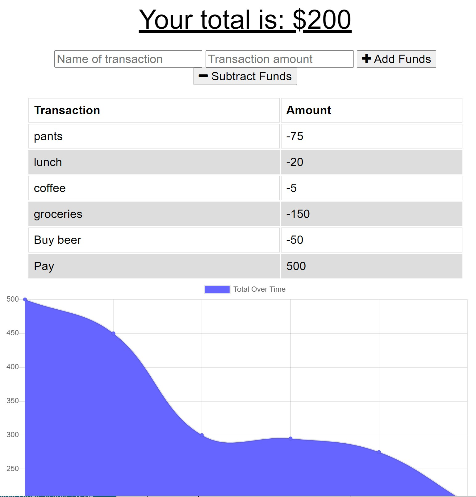

# budget-tracker
Allow a user to track their budget online and offline.

## User Story

Given a frontend consisting of 1 html file and associated css and javascript files, the requirement was to provide backend functionality to allow a user to add income and expenses in a budget tracker in both online and offline mode. Any transactions entered when offline are to sync with the mongoDB when network functionality resumes.

## Built With

- [VScode](https://code.visualstudio.com/) - The editor of choice

#### Initial interface

### Licence

MIT License

### Link to app on Heroku

<a href="https://immense-beyond-23497.herokuapp.com">Budget Tracker</a>

### Link to the github Repo

<a href="https://github.com/galluk/budget-tracker">budget-tracker</a>

## Author

- **Luke Gallagher** -
  luke.gallagher.cst@gmail.com